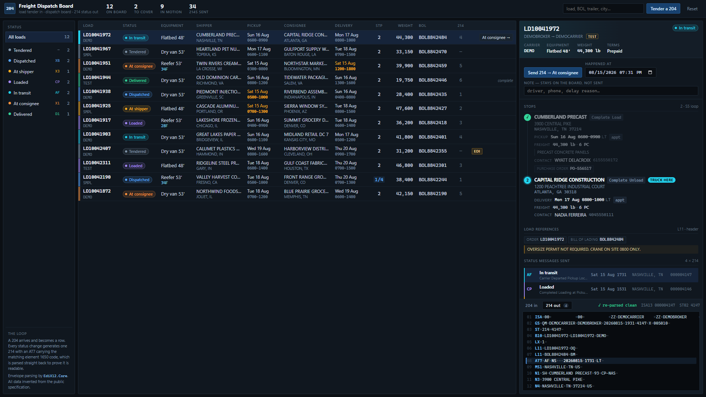
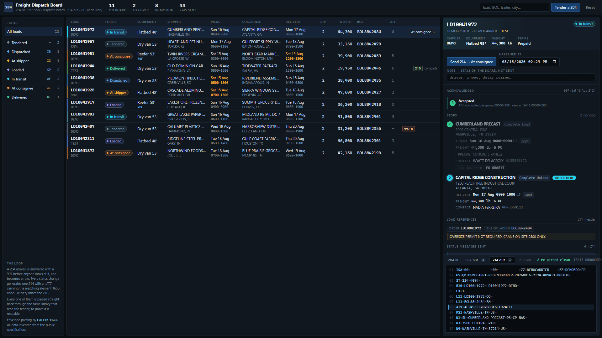
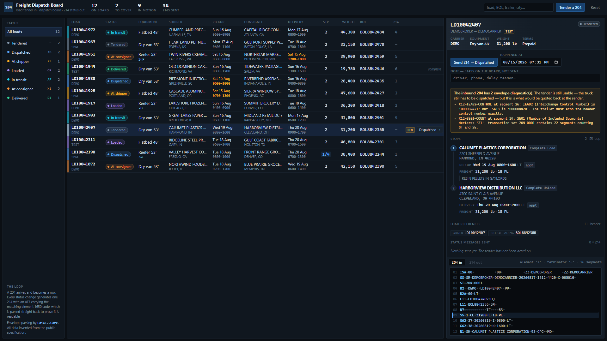

# Freight Dispatch Board

**Load tender in, dispatch board, status updates out.** An EDI 204 arrives, becomes a row a
dispatcher can work, and every status change on that row generates the 214 that reports it
back to the tendering party.

That loop is the core of every freight brokerage in the country, and it is normally hidden
inside a TMS costing five figures a year. This is the smallest honest version of it: .NET 8
minimal API, Angular, and a screen you can read.



A 204 pasted in, the load landing on the board, and six status changes walking it through a
four-stop run — with the generated 214 alongside at every step:



## The loop

```
204 load tender  ──►  parse  ──►  normalise  ──►  board row
                                                     │
                                          dispatcher moves the load
                                                     │
                                                     ▼
                                        214 status message  ──►  parsed straight back
```

The last step is the one that matters. Every 214 this generates is immediately re-parsed by
the same library that reads inbound files, and its envelope validated. The panel says
`✓ re-parsed clean` or lists what is wrong. A generator that has never been read by a parser
is a generator that works until the first partner tries it.

## What the board shows

| Board status | X12 element 1650 | Meaning on the wire |
|---|---|---|
| Tendered | — | Nothing sent. The 204 arrived and nobody has acted on it |
| Dispatched | `XB` | Shipment Acknowledged |
| At shipper | `X3` | Arrived at Pickup Location |
| Loaded | `CP` | Completed Loading at Pickup Location |
| In transit | `AF` | Carrier Departed Pickup Location with Shipment |
| At consignee | `X1` | Arrived at Delivery Location |
| Delivered | `D1` | Completed Unloading at Delivery Location |

Loads move forward one step at a time. There is no path back, because a 214 is a statement
about something that happened and you cannot un-send it — the correction is a further 214,
not a rewrite.

**The codes depend on the stop, not only on the state.** Arriving somewhere is `X3` at a
pickup and `X1` at a delivery; finishing there is `CP` against `D1`; leaving is `AF` against
`CD`. So the table above is the two-stop case, and a load with more stops than that cycles.

Partners do vary. Some want `AF` for departure and nothing for loading, some want `X6` pings
every four hours in transit, some reject `XB` outright because they treat the 990 as the
acknowledgment. That variation is why the mapping is a table in `StatusCatalog` and not a
switch statement buried in the 214 writer.

## Running it

```bash
# API + the compiled client on one origin
cd src/FreightDispatch.Api
dotnet run
# http://localhost:5000

# or, for client work, the Angular dev server proxying to the API
cd web
npm install
npm start          # http://localhost:4200, /api proxied to :5199
```

The board seeds itself on startup with four sample tenders and eight invented lanes, moved
to a spread of statuses. Everything arrives through the same `Tender()` path as a pasted
file, so the seed is also a smoke test of the reader every time the process starts.

```bash
dotnet build -c Release
dotnet test
cd web && npm run build      # writes to src/FreightDispatch.Api/wwwroot
```

The .NET 8 SDK is the minimum and it is enough: no `global.json` pins anything newer, and the
solution is in the classic `.sln` format rather than `.slnx`, which needs a 9.0.200 SDK to
open. Node 20.19+, 22.12+ or 24 for the client (Angular 21). `Directory.Build.props` sets
`RollForward=Major` so the `net8.0` app also starts on a machine that only has a 10.x runtime.

## What of the 204 it reads

The 204 body is a header area followed by a repeating S5 stop-off loop. There is no explicit
loop terminator in X12 — a loop ends when the next loop's trigger segment appears, or when
the transaction set does — so the reader is a small state machine: everything before the
first S5 belongs to the load, everything after belongs to the stop most recently opened.

| Segment | Read as |
|---|---|
| `B2` | SCAC (B202), shipment identification number (B204), method of payment (B206) |
| `B2A` | Transaction set purpose (00 original, 04 change, 01 cancellation) |
| `L11` | Reference numbers, scoped to the load or to the open stop |
| `N7` | Equipment: trailer (N702), description code (N711), temperature (N713), length (N715) |
| `L3` | Total weight and qualifier |
| `S5` | Stop sequence, reason code, weight, units |
| `G62` | The stop's window — see below |
| `N1`/`N3`/`N4`/`G61` | Party, address, contact for the open loop |
| `L5` | Lading description |
| `OID` | Purchase order (OID02), folded into the stop's references |
| `NTE` | Notes, scoped to the load or to the open stop |

Anything else is ignored rather than rejected. A tender carrying thirty segments this reader
has no use for is still a tender, and refusing it would be the wrong answer to "the shipper
added a segment".

### Windows are a pair of segments, not a field

A 204 does not carry "the appointment". It carries G62 segments whose qualifiers say which
end of the window each one is:

```
pickup     G62*37  Ship Not Before Date        G62*38  Ship Not Later Than Date
delivery   G62*53  Deliver Not Before Date     G62*54  Deliver No Later Than Date
```

A single `G62*10` with no partner is an open-ended request, not a defect, and the board shows
it as such instead of inventing a closing time nobody agreed to. The times carry no zone —
X12 has none, and element 623 (`LT`) says the sender meant local time at the stop — so they
are held and displayed as wall clock values and never converted.

## What the 214 it writes looks like

5010 puts the N1 party loop in the **detail** area, inside the LX loop and after the
AT7/MS1/MS2 group. Putting it in the heading next to B10 is the intuitive order and the
wrong one.

```
ISA*00*          *00*          *ZZ*DEMOCARRIER    *ZZ*DEMOBROKER     *260815*1540*^*00501*000004070*0*T*:~
GS*QM*DEMOCARRIER*DEMOBROKER*20260815*1540*4070*X*005010~
ST*214*4070~
B10*LD10041972*LD10041972*DEMO~          B1002 is what the partner matches on
LX*1~
L11*LD10041972*OQ~                       the tender's references, echoed back
L11*BOL8842484*BM~
AT7*AF*NS***20260815*1540*LT~            the status itself
MS1*NASHVILLE*TN*US~                     where the truck was
N1*SH*CUMBERLAND PRECAST*93*CP-NAS~
N3*3900 CENTRAL PIKE~
N4*NASHVILLE*TN*37214*US~
...
SE*16*4070~
GE*1*4070~
IEA*1*000004070~
```

Three things get written wrong more often than everything else combined, and all three are
handled by the writer rather than left to the caller:

1. **The ISA is fixed-width** — 105 characters plus a terminator, every element a defined
   length. Receivers read the delimiters out of it by byte offset, so an ISA one character
   short is not a formatting nit, it is a file the other end cannot tokenize.
2. **SE01 counts the ST and the SE themselves.** Counting only the body is the single most
   common reason a structurally fine document is rejected.
3. **Trailers echo headers**: IEA02 = ISA13, GE02 = GS06, SE02 = ST02.

The 214 also travels back the way the 204 came, so sender and receiver swap. Getting that
backwards produces a file the partner routes into its own inbound queue and then reports as
an unknown sender.

## Multi-stop loads

A truckload move is a sequence of stops, not a pickup and a delivery. Three pickups and a
drop is ordinary; so is one pickup and four drops. The board carries a **current-stop
pointer** and every status message is reported against it, so a 214 sent from stop two of
four says stop two.

The pointer moves on *departure*, not arrival — that is the moment the truck stops being at
one place and starts running to the next. And leaving a stop it had arrived at produces
**two** status messages from one click, because the work finishing and the truck leaving are
different codes and a partner tracking a multi-drop load needs both. The `D1` is the proof of
delivery for that stop's freight.

`samples/204-reefer-multi-stop.edi` — load in Fresno, part-unload in Reno, part-unload in
Salt Lake City, complete unload in Denver — runs like this, and there is a test asserting
exactly this sequence:

```
XB  FRESNO           acknowledged, heading to the pickup
X3  FRESNO           arrived at pickup
CP  FRESNO           loading complete
AF  FRESNO           departed the pickup with the freight
X1  RENO             arrived at drop one
D1  RENO             part unload complete
CD  RENO             departed drop one
X1  SALT LAKE CITY
D1  SALT LAKE CITY
CD  SALT LAKE CITY
X1  DENVER           arrived at the final drop
D1  DENVER           complete unload — the load is done
```

The board shows `2/4` on the row and marks the stop the truck is at in the detail panel,
with the stops behind it ticked off. A two-stop load walks straight through and never sees
the cycle.

## Delimiters are declared, not assumed

`samples/204-flatbed-pipe-delimited.edi` uses `|` as the element separator, `>` as the
component separator and a newline as the segment terminator. All of it legal, all of it
declared inside the ISA, and all of it fatal to a parser that starts with `text.Split('~')`.
It parses to the same shape of load as the conventional samples, and the detail panel reports
what it read: `element '|' · terminator '\n' · 29 segments`.

## Sample tenders

| File | What it is for |
|---|---|
| `204-dry-van-2-stop.edi` | The ordinary case — one pickup, one delivery, windows on both ends |
| `204-reefer-multi-stop.edi` | Four stops, temperature control in N713, partial unloads, and a stop whose PO arrives in an `OID` rather than an `L11` |
| `204-flatbed-pipe-delimited.edi` | The delimiter case above |
| `204-bad-se-count.edi` | SE01 declares 21 where there are 22, and IEA02 does not echo ISA13. The tender still loads; the diagnostics say what is wrong |

The last one is the point of showing diagnostics rather than throwing. A parser that refuses
to show you a bad file is useless for the one job you actually need it for, which is working
out why the partner rejected it — and meanwhile the truck still has to be dispatched.



## Layout

```
src/FreightDispatch.Core     model, 204 reader, 204/214 writers, the board
src/FreightDispatch.Api      minimal API, DTOs, seed data
tests/FreightDispatch.Tests  52 tests, including a full 204 round trip and the
                             twelve-message walk of the four-stop reefer
web/                         Angular client
samples/                     the four sample tenders
```

Envelope parsing is [`EdiX12.Core`](../edi-x12-toolkit) — it reads the delimiters out of the
ISA and hands back ST/SE transaction sets, which is why nothing in this repository splits on
a tilde. It is currently a project reference to the sibling repository; see
[docs/edi-toolkit-dependency.md](docs/edi-toolkit-dependency.md).

## Provenance

Everything here is written from the published ANSI X12 specification. Every shipper,
consignee, address, contact name, telephone number, SCAC, load number, bill of lading and
purchase order is invented. Nothing derives from any real trading partner, any partner's
implementation guide, or any production interchange.

`DEMOBROKER`, `DEMOCARRIER` and the SCACs `DEMO`, `SMPL` and `TEST` are not real trading
partners. ISA15 is `T` in every sample, because a sample file that says `P` is a sample file
somebody will eventually send into a production endpoint.

This project is not affiliated with, endorsed by, or derived from the Accredited Standards
Committee X12. "X12" is used here only to name the standard it reads.

## Not built yet

State is in memory, one process. A real board needs the loads, the status events and the
control number sequence in one durable transaction — those three going out of step is how a
partner ends up with two interchanges numbered `000000417` and no way to tell which one was
the delivery.

There are no exception statuses yet: the board can report a load going right and not a load
going wrong. `SD` Shipment Delayed with a real element 1651 reason — `AO` weather, `AI`
mechanical breakdown, `B1` consignee closed — is the next thing it needs, because delays are
most of what a dispatcher actually keys.

## License

MIT.
